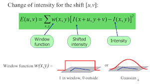
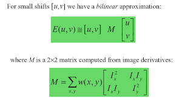
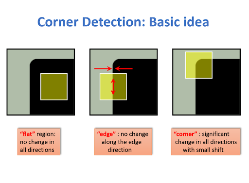
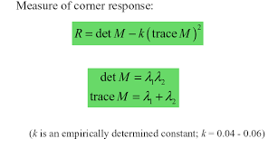
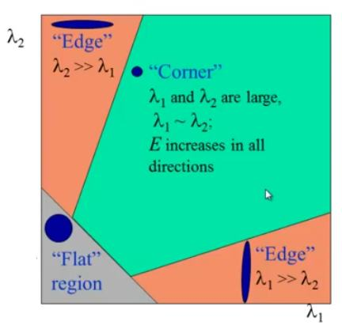
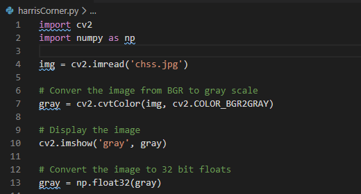
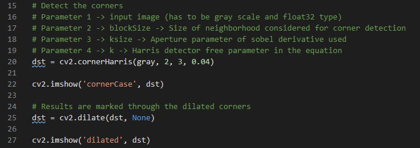
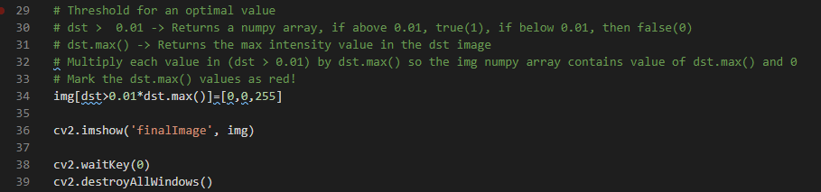

# harrisCorner

What is Harris Corner Detection? 
It is a commonly used computer vision algorithm to extract corners of an image. Introduced by Chris Harris and Mike Stephens.

**Corner Detection**: Locations in an image with a large change of intensity along the x and y axis 

Simple steps of Harris Corner Detection algorithm:
1.	Determine (a window) what part of the image have a large variation in intensity when moved along the x and y axis. 
2.	Within each window, compute the value R.
3.	Apply a threshold to select and mark the corners

Mathematical view of algorithm:
1.	Determine windows that contain large variations of intensity. 
Window: (x,y) 
Intensity of a pixel: I(x,y) 
Window shift displacement: (u, v) 
Intensity of pixel at location with displacement: I(x + u, y + v) 
Difference in intensity: I(x + u, y + v) – I(x, y) 

Window function outputs the weights to pixels by using the rectangular window or gaussian window. To maximize the function below, the second term has to be maximized. To do so efficiently, the Taylor Expansion is used.

  

 
The Taylor expansion is used to find the infinite sum at a single point. As a result, it generates the mathematical equation below.

  

 

2.	Determine if a window contains a corner
By computing the value R, it returns a gray scale image with the corners (in code). The R value will tell the user if the window is a flat region, corner region or edge region.

  

 

R is computed by calculating the determinant of M subtracted by the empirically determined constant multiplied by the square of the trace of M.

  

 

•	When |R| is small --> Both eigenvalues are small, so it is a flat region  
•	When R < 0 --> One eigenvalue is greater than the other, so it is an edge  
•	When R is large --> Both eigenvalues are large and close in numbers, so the region is a corner  

  

 

**Code Breakdown**
 

  

Line 1 + 2: Import necessary libraries to use for this code
Line 4: Read in image file and assign to variable ‘img’ 
Line 7: Convert the image from BGR to gray scale 
Line 10: Show gray scale image to user 
Line 13: Convert the image to be 32 bit float data type because the Harris Corner function only takes in 32 bit floats 

 

  

Line 20: Use OpenCV’s library function called cornerHarris to detect the corner cases in the image
Line 22: Display all the corners in the image 
Line 25: Dilate the corners to look more visible to the user 
Line 27: Display to user the dilated corners in image 

 

  

Line 34: Threshold value R and color the corners red.
Line 36: Display image with corners marked red 
Line 38: Press any key to kill all windows and kill code 
Line 39: Deallocate all memory used for this code 

References: 
[Open CV Documentation](https://docs.opencv.org/master/dc/d0d/tutorial_py_features_harris.html) 
[Detect Corners Medium Blog](https://medium.com/pixel-wise/detect-those-corners-aba0f034078b) 

